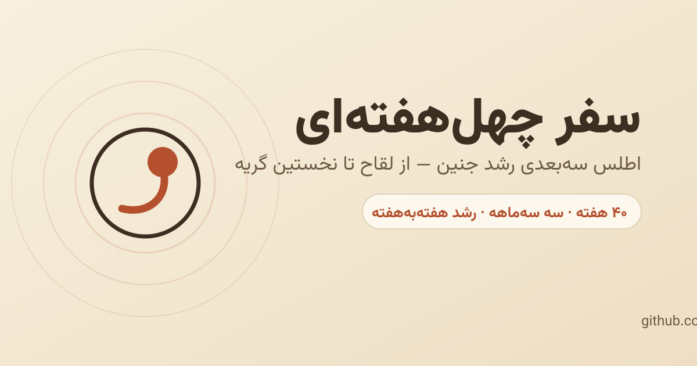

<div dir="rtl" align="center">

# سفر چهل‌هفته‌ای 

**اطلس تعاملی و سه‌بعدی رشد جنین — از لقاح تا نخستین گریه**

[](https://alib11.github.io/Birth-Journey/)
[](https://github.com/AliB11/Birth-Journey/actions/workflows/ci.yml)
[](https://github.com/AliB11/Birth-Journey/actions/workflows/deploy-pages.yml)
[](LICENSE)
[](LICENSE-CONTENT)



سفر هفته‌به‌هفتهٔ جنین در ۴۰ هفتهٔ بارداری؛ با نمای سه‌بعدی تعاملی (چرخش، بزرگ‌نمایی، برچسب‌های آناتومیک)، داده‌های رشد بر پایهٔ صدک ۵۰ جداول مرجع، و راهنمای هفته‌به‌هفتهٔ تغذیه، آزمایش‌ها و تغییرات بدن مادر.

**➡️ [مشاهدهٔ نسخهٔ زنده](https://alib11.github.io/Birth-Journey/)**

</div>

---

<div dir="rtl">

## ✨ ویژگی‌ها

- **نمای سه‌بعدی پارامتریک** جنین، رحم، جفت، بند ناف و کیسهٔ آمنیوتیک که هفته‌به‌هفته رشد و تغییر وضعیت می‌دهد (three.js، بدون مدل خارجی).
- **نسخهٔ دوبعدی SVG** به‌عنوان fallback برای مرورگرهای بدون WebGL — همان داده‌ها، همان دقت روایت.
- **تایم‌لاین ۴۰ هفته** با دسته‌بندی سه‌ماهه‌ها، نوار پیشرفت، پخش خودکار سفر و پیوند یکتا برای هر هفته (`#w12`).
- **چهار برگهٔ اطلاعاتی** برای هر هفته: وضعیت جنین، تغذیهٔ مادر، آزمایش‌ها و پایش، بدن مادر.
- **داده‌های رشد** (طول، وزن، ضربان قلب) بر مبنای صدک ۵۰ جداول مرجع (هادلاک/فنتون).
- **راست‌به‌چپ و فارسی** با فونت وزیرمتن (میزبانی محلی)، واکنش‌گرا از موبایل تا دسکتاپ.
- **دسترس‌پذیری**: الگوی ARIA برای تب‌ها، نوار پیشرفت معنادار، ناحیهٔ زنده صفحه‌خوان، ناوبری کامل با صفحه‌کلید، کاهش حرکت بر پایهٔ `prefers-reduced-motion` و کنتراست رنگ مطابق WCAG 2.1 AA.
- **بدون نیاز به بیلد**: یک `index.html` + وابستگی‌های میزبانی‌شده در `vendor/`؛ حتی به‌صورت آفلاین (با بازکردن مستقیم فایل) کار می‌کند.

## 🚀 راه‌اندازی محلی

```bash
# بدون هیچ وابستگی:
npm run serve            # یا: node tools/serve.mjs 8080
# سپس: http://localhost:8080
```

یا ساده‌تر: `index.html` را مستقیماً در مرورگر باز کنید — همهٔ کتابخانه‌ها و فونت به‌صورت محلی در مخزن هستند.

برای آزمون‌ها و lint (اختیاری، نیازمند Node.js ≥ 20):

```bash
npm install
npm run check            # lint (html-validate) + آزمون‌های jsdom
```

##  ساختار مخزن

```text
├── index.html               # کل وب‌اپ (نشانه‌گذاری + سبک + منطق) — بدون بیلد
├── assets/                  # favicon، تصاویر شبکه‌های اجتماعی
├── vendor/                  # three.js، lucide و فونت وزیرمتن + پروانه‌هایشان
│   └── README.md            # جدول سرچشمه و روش به‌روزرسانی وابستگی‌ها
├── tools/serve.mjs          # سرور ایستای توسعه/پیش‌نمایش
├── tests/smoke.test.js      # آزمون دود: راه‌اندازی صفحه در jsdom
├── .github/workflows/       # CI و دیپلوی GitHub Pages
└── LICENSE / LICENSE-CONTENT# پروانهٔ کد (MIT) و محتوا (CC BY-NC 4.0)
```

## 🧪 آزمون و کیفیت

- `npm test` — آزمون دود با jsdom: راه‌اندازی کامل صفحه، ساخت ۴۰ هفته، تعامل تب‌ها/هفته‌ها، دسترس‌پذیری پایه و بررسی وجود همهٔ منابع محلی.
- `npm run lint` — اعتبارسنجی HTML با html-validate.
- هر دو در CI روی push و pull request اجرا می‌شوند؛ دیپلوی Pages فقط پس از موفقیت CI روی `main`.

## ⚕️ سلب مسئولیت پزشکی

این برنامه **صرفاً آموزشی** است و جایگزین مشاورهٔ پزشکی نیست. طول و وزن جنین بر مبنای صدک ۵۰ جداول مرجع رشد (هادلاک/فنتون) و سایر داده‌ها بر پایهٔ متون مرجع رشد جنین و دستورالعمل‌های عمومی مراقبت بارداری (ACOG/WHO) گردآوری شده و همگی **تقریبی و متغیرند**. دربارهٔ سلامت خود و جنین‌تان همواره با پزشک یا ماما مشورت کنید.

اشکال محتوایی/علمی را با برچسب `content` در [ایشوها](../../issues) گزارش کنید.

## 🤝 مشارکت

خوشحال می‌شویم! پیش از شروع، [راهنمای مشارکت](CONTRIBUTING.md) و [پیمان رفتاری](CODE_OF_CONDUCT.md) را بخوانید. خلاصه:

1. یک ایشو باز کنید (باگ، محتوا، ویژگی) یا یک ایشوی موجود را بردارید.
2. از `main` شاخه بسازید، تغییر دهید و `npm run check` را سبز کنید.
3. Pull Request باز کنید و الگوی PR را پر کنید.

## 🔐 امنیت

برای گزارش آسیب‌پذیری‌ها [SECURITY.md](SECURITY.md) را ببینید؛ لطفاً آسیب‌پذیری را عمومی گزارش نکنید.

## 📜 پروانه

- **کد منبع**: پروانهٔ MIT — see [LICENSE](LICENSE).
- **محتوای آموزشی/متنی و طراحی بصری**: پروانهٔ Creative Commons Attribution-NonCommercial 4.0 — see [LICENSE-CONTENT](LICENSE-CONTENT).
- وابستگی‌های میزبانی‌شده پروانه‌های خود را دارند: three.js (MIT)، Lucide (ISC)، وزیرمتن (SIL OFL 1.1) — see [vendor/README.md](vendor/README.md).

</div>

---

<div dir="ltr">

## Birth Journey — English summary

An interactive, RTL Persian **3D atlas of fetal development across all 40 weeks of pregnancy**: a parametric three.js scene (fetus, uterus, placenta, umbilical cord, amniotic sac) that morphs week by week, a 2D SVG fallback for WebGL-less browsers, per-week nutrition / tests / maternal-body guides, deep links per week (`#w12`), autoplay “journey” mode, and full keyboard + screen-reader support.

- **Zero build step**: one `index.html` plus self-hosted dependencies in `vendor/` (three.js r147, Lucide 0.294, Vazirmatn variable font). Works offline and on GitHub Pages.
- **Quality gates**: jsdom smoke tests + html-validate in CI; Pages deployment via GitHub Actions.
- **License**: code MIT, educational content CC BY-NC 4.0.
- **Disclaimer**: educational only — not medical advice.

Quick start: `npm run serve` → <http://localhost:8080>

</div>
